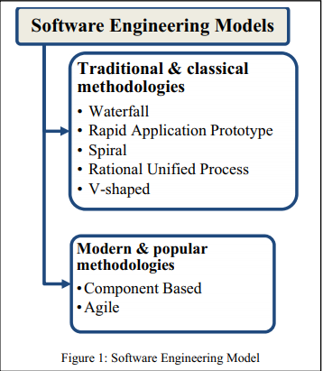

# Readings

## Comparative Analysis of Software Engineering Models (2014)

G. Kumar and P. K. Bhatia, "Comparative Analysis of Software Engineering Models from Traditional to Modern Methodologies," 2014 Fourth International Conference on Advanced Computing & Communication Technologies, Rohtak, India, 2014, pp. 189-196, doi: 10.1109/ACCT.2014.73. [ComparingModels.pdf](ComparingModels.pdf).

> Software Engineering aims to produce a quality software product that is delivered on time, within the allocated budget, and with the requirements expected by the customer but unfortunately maximum of the times this goal is rarely achieved. A software life cycle is the series of identifiable stages that a software product undergoes during its lifetime. However, a properly managed project in a matured software engineering environment can  consistently achieve this goal.

## Model-driven software engineering workflow (2018)

Ntanos, E., Dimitriou, G., Bekiaris, V. et al. A model-driven software engineering workflow and tool architecture for servitised manufacturing. Inf Syst E-Bus Manage 16, 683–720 (2018). [DOI](https://doi-org.proxy1.ncu.edu/10.1007/s10257-018-0371-5). [ModelDriven.pdf](ModelDriven.pdf).

## Extreme Programming in Academia (2018)

L. Sadath, K. Karim and S. Gill, "Extreme programming implementation in academia for software engineering sustainability," 2018 Advances in Science and Engineering Technology International Conferences (ASET), Dubai, Sharjah, Abu Dhabi, United Arab Emirates, 2018, pp. 1-6, doi: 10.1109/ICASET.2018.8376925. [ExtremeProgramming.pdf](ExtremeProgramming.pdf).

## The DevOps adoption playbook (2017)

Sharma, S. (2017). The DevOps adoption playbook : a guide to adopting devOps in a multi-speed IT enterprise. John Wiley and Sons.
