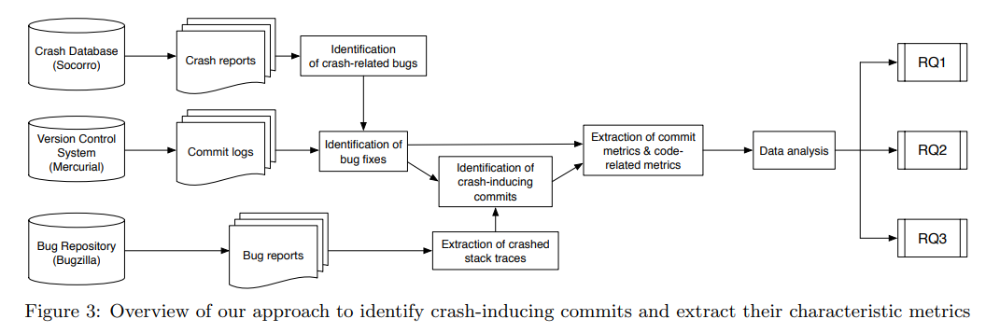

# Readings

## A dataset of open-source Android applications (2015)

Daniel E. Krutz, Mehdi Mirakhorli, Samuel A. Malachowsky, Andres Ruiz, Jacob Peterson, Andrew Filipski, and Jared Smith. 2015. A dataset of open-source Android applications. In Proceedings of the 12th Working Conference on Mining Software Repositories (MSR '15). IEEE Press, 522–525. [DOI](https://dl-acm-org.proxy1.ncu.edu/doi/10.5555/2820518.2820603). [Android-DataSet.pdf](Android-DataSet.pdf).

|Tool|Description|
|----|---------|
|Stowaway| Static analysis tool for finding under/over permissions|
|Androrisk| Androguard reverse engineering tool.  Calculates risk indicators of an app|
|Sonar| Source code analyzer covering 7 axes of code quality (architecture and design, comments, coding rules, potential bugs, complexity, unit tests, and duplications)|
|FindBugs | Static analysis tool for finding Java issues
|Checkstyle| Java source analysis tool|
|PMD| Identifies maintainability risks within a codebase|

## Empirical investigation of socio-technical code review metrics (2014)

Andrew Meneely, Alberto C. Rodriguez Tejeda, Brian Spates, Shannon Trudeau, Danielle Neuberger, Katherine Whitlock, Christopher Ketant, and Kayla Davis. 2014. An empirical investigation of socio-technical code review metrics and security vulnerabilities. In Proceedings of the 6th International Workshop on Social Software Engineering (SSE 2014). Association for Computing Machinery, New York, NY, USA, 37–44. [DOI](https://doi.org/10.1145/2661685.2661687). [SocioTechnicalMetrics.pdf](SocioTechnicalMetrics.pdf).

## Do bugs foreshadow vulnerabilities (2015)

Felivel Camilo, Andrew Meneely, and Meiyappan Nagappan. 2015. Do bugs foreshadow vulnerabilities? a study of the Chromium project. In Proceedings of the 12th Working Conference on Mining Software Repositories (MSR '15). IEEE Press, 269–279. [ForeshadowVulns.pdf](ForeshadowVulns.pdf). [DOI](https://dl-acm-org.proxy1.ncu.edu/doi/pdf/10.5555/2820518.2820551).

## Sentiment analysis of commit comments in GitHub (2014)

Emitza Guzman, David Azócar, and Yang Li. 2014. Sentiment analysis of commit comments in GitHub: an empirical study. In Proceedings of the 11th Working Conference on Mining Software Repositories (MSR 2014). Association for Computing Machinery, New York, NY, USA, 352–355. [DOI](https://doi.org/10.1145/2597073.2597118).  [SentimentAnalysis.pdf](SentimentAnalysis.pdf).

## Empirical Study of Crash-inducing Commits (2015)

Le An and Foutse Khomh. 2015. An Empirical Study of Crash-inducing Commits in Mozilla Firefox. In Proceedings of the 11th International Conference on Predictive Models and Data Analytics in Software Engineering (PROMISE '15). Association for Computing Machinery, New York, NY, USA, Article 5, 1–10. [DOI](https://doi.org/10.1145/2810146.2810152). [FirefoxCrashes.pdf](FirefoxCrashes.pdf).

**RQ1: What is the proportion of crash-inducing commits in Firefox?**

We analyse Firefox’ crash reports and link them to the corresponding crash-related bugs. We then use the SZZ algorithm [32] to map these bugs to their related commits and identify the commits due to which the crash-related bugs occurred. We found that crash-inducing commits account for 25.5% in the studied version control system.

**RQ2: What characteristics do crash-inducing commits possess?**

By investigating the characteristics of crash-inducing commits and other commits, we found that, in general, crash-inducing commits are submitted by developers with less experience and are more often committed by developers from Mozilla. Developers change more files, add and delete more lines in crash-inducing commits Compared to other commits, more crashinducing commits fix a previous bug, and often, they lead to another bug. In terms of changed types, crash-inducing commits contain more unique changed types and the changed statements tend to  be scattered in more changed types, while other commits tend to be changed on a specific changed type.

**RQ3: How well can we predict crash-inducing commits?**

Previous studies, which proposed statistical models to predict defects from bug reports, could be effective to some extent. However, before a certain type of crashes is filed into the crash collecting system, a large number of end users might have already suffered a negative experience. Moreover, during this period, developers may become less familiar with the code. In this case, they may spend more time identifying the erroneous lines to fix the problems. Therefore, statistical models that can predict error-prone code just-in-time are required to help software practitioners detect crash-inducing commits and effectively fix them early. We use GLM, Naive Bayes, C5.0, and Random Forest algorithms to predict whether or not a commit will induce future crashes. Our predictive models can reach a precision of 61.4% and a recall of 95.0%. Software organisations can apply our proposed technique to improve their defect triaging process and the satisfaction of their users.

## Characterizing Verification of Bug Fixes (2012)

Souza, R., & Chavez, C. (2012). Characterizing Verification of Bug Fixes in Two Open Source IDEs @ MSR 2012. [YouTube](https://youtu.be/_jaJlvyLoTk).
