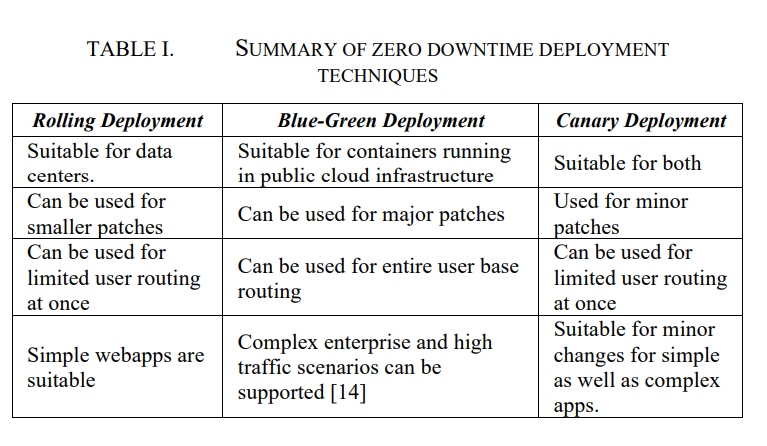

# Zero Downtime Deployments

## Application Cluster Service Scheme for Near-Zero-Downtime Services (2005)

Fan-Tien Cheng, Shang-Lun Wu, Ping-Yen Tsai, Yun-Ta Chung and Haw-Ching Yang, "Application Cluster Service Scheme for Near-Zero-Downtime Services," Proceedings of the 2005 IEEE International Conference on Robotics and Automation, Barcelona, Spain, 2005, pp. 4062-4067, doi: 10.1109/ROBOT.2005.1570743. [ClusterScheme.pdf](ClusterScheme.pdf).

### What is the problem

International Technology Roadmap for Semiconductors (ITRS) requires their _Factory Information and Control Systems_ to offer 99.98% availability.  Typically businesses meet this requirement with clustering services (e.g., Microsoft Cluster Service).  These solutions rely on heartbeating mechanisms across private networks.  Others deploy middle-ware technology that transparently retries the operation.

### What did they do

The authors propose an `Application Cluster Service with Performance Evalutor` (APCS+PEV) that _monitors performance degradation and predicts time until node failure.  Combining APCS with PEV and using the detection and prediction capabilities of the PEV, the APCS can perform the failover process before an application program or a node breakdown. Consequently, a distributed computer system can provide services with near-zero-downtime by applying APCS+PEV_.

Within the cluster, an election process promotes one slave node to master.  The master then sends pings to other nodes to monitor for availability.  Cheng et al. enhance traditional pings to collect `software aging` metadata then _applying multi-variate analysis and factor analysis, only four key parameters, namely, processor time, privileged time, pool nonpaged bytes, and available Mbytes are extracted as the inputs of the fuzzy logic detection module_.

Each slave also contains a data collection agent.  This agent publishes the software age statistics, which improves the performance, and removes the need for dedicated master node.

### What assumptions are here

They assume that both the shared storage and network are perfectly reliable.

## Comparison of zero downtime based deployment techniques (2020)

C. K. Rudrabhatla, "Comparison of zero downtime based deployment techniques in public cloud infrastructure," 2020 Fourth International Conference on I-SMAC (IoT in Social, Mobile, Analytics and Cloud) (I-SMAC), Palladam, India, 2020, pp. 1082-1086, doi: 10.1109/I-SMAC49090.2020.9243605. [DeploymentTechniques.pdf](DeploymentTechniques.pdf).

The authors examine strategies for deploying micro-services with Blue Green deployments.

> We found that `DNS swap technique` is most simple way of performing the BG deployments. But we found that it is not cost effective as it needs entire infrastructure to be duplicated. Also, the swap time and roll back time is higher due to the additional DNS time to live (TTL) parameter. On the other hand, the `load balancer swap technique` was found to be better performing in terms of swap time than the previous approach.

