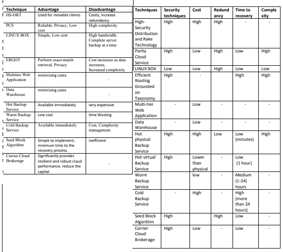

# Disaster Recovery

## Disaster Recovery Techniques in Cloud Computing (2019)

A. A. Tamimi, R. Dawood and L. Sadaqa, "Disaster Recovery Techniques in Cloud Computing," 2019 IEEE Jordan International Joint Conference on Electrical Engineering and Information Technology (JEEIT), Amman, Jordan, 2019, pp. 845-850, doi: 10.1109/JEEIT.2019.8717450. [RecoveryTechniques.pdf](RecoveryTechniques.pdf).

### Causes of Data Loss

|Reason|Description|
|------|------------|
|Natural Disasters|  Natural disasters are the most uncontrollable cause. Such as, fires, floods, earthquakes, even brownouts, all of them are out of our control. Fortunately, according to the survey, only 2 % of users lost data because of natural disasters. [6]|
|Mission critical application failure| Sudden damage to the application may occur when left unused for days, resulting in loss of data that may be important in some organizations. [6, 11]
|Network failure| When the network crashes, cloud-related systems are disrupted, and cloud-based data and applications are lost because the cloud and clients are connected via the Internet. If the network fails will also suffer IP-based telephony and telecommunications.|
|Network intrusion| When viruses are invaded by applications, a disaster is created. To avoid a disaster, anti-virus applications are used and programs are placed on the disaster monitoring list.[6, 11]|
|Hacking or malicious code| You know that computer viruses can slow down your and steal credit card information. In fact, computer viruses or other malware also can spread like wildfire causing partial or complete damage to your important data. Therefore, it is essential that you should install good antivirus software and keep it updated. [6]|
|System failure| Operating systems are affected if the organization's infrastructure fails, resulting in the failure of the organization-wide systems. [6, 11]
|Human Errors| Believe or not, human error is also one of the most common causes of data loss. Normally, the main reason for the occurrence of a disaster is human, 60% of the data centers are failed. There are two kinds of human errors causing data loss, one is clicking Delete or Format button to erase something we don't mean to, and another one is causing physical damages because of dropping or failing our storage device by accident.

### Disaster Recovery Techniques

> In our literature survey, we found many techniques that are having their unique ways to create backup and recovery. Broadly speaking, all those techniques focus on three different aspects, such as cost control, data duplication and security issues. Each of the technique has the complete focus on their aim of backup and recovery.

## Leveraging disaster recovery as a cloud migration path (2019)

Jasgur, C. (2019). Leveraging disaster recovery in the cloud as a cloud migration path: A case study. Journal of Business Continuity & Emergency Planning, 13(2), 150–159. [EBSCO](https://search-ebscohost-com.proxy1.ncu.edu/login.aspx?direct=true&db=tsh&AN=139908027&site=eds-live). [DR_as_MigrationPath.pdf](DR_as_MigrationPath.pdf).

> Disaster recovery focuses on the information or technology systems that support business functions, as opposed to business continuity which involves planning for keeping all aspects of a business functioning in the midst of disruptive events. Disaster recovery is a subset of business continuity. Disaster recovery is now normally only used in reference to an organisation’s information technology and telecommunications recovery

## Instantaneous Networking Service Availability for Disaster Recovery (2020)

Teng R, Sakano T, Suzuki Y. Instantaneous Networking Service Availability for Disaster Recovery. Applied Sciences. 2020; 10(24):9030. doi: 10.3390/app10249030. [InstantaneousAvailability.pdf](InstantaneousAvailability.pdf).

> In summary, a number of studies have `addressed the communication systems and information sharing systems that support the capability of disaster resilience`. However, few of the previous studies explicitly addressed the effectiveness of prompt and partial recovery of networking services and the speed of network restoration in the disaster situation according the communication features and population distribution. Moreover, `it is difficult to utilize the conventional metrics on system availability and reliability to assess the effectiveness of temporary and partial recovery of networking services`. Considering communication and population distribution in a disaster situation, local and partial recovery of networking services should also facilitate communication among users. This paper explicitly addresses `the effectiveness of user service restoration procedure before the network is fully recovered, and examines the instant availability of networking service in a disaster situation`. We evaluate the instant availability of networking service based on a local cloud system that enables the joint provision of communication support and information support for users in the disaster situation.

> By employing LI-Cloud, network restoration is enabled by two phases. One is the `local restoration process`. Another is the `global restoration process`. The local restoration process refers to the launching of LI-Cloud service for the local users. The procedure allows LI-Clouds to be deployed and configured in an isolated area after a disaster.
> Compared with conventional methods for measuring the networking availability, I-NSA is an integrated factor that involves both network connectivity and user distribution among various areas. I-NSA has its unique features that facilitate the design of novel networking services such as Local-and-Instant Clouds for disaster resilience. First, the `I-NSA measures the networking service availability from the temporary and partial recovery of the network`. Second, `I-NSA allows us to assess the functionality and effectiveness of the network restoration process before the network is fully recovered`. We especially examined the I-NSA of using LI-Clouds in a disaster situation. The evaluation results showed the significant improvement of networking service availability with utilization of LI-Clouds in various deployment scenarios of LI-Clouds.
