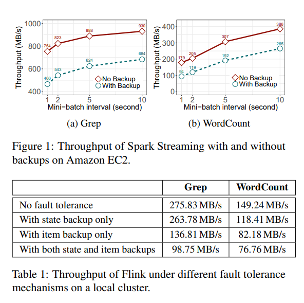
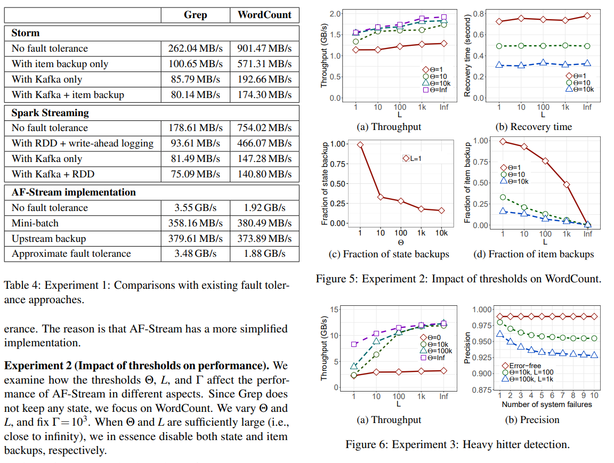

# Fault Tolerance

## Performance of distributed stream processing via approximate fault tolerance (2019)

Cheng, Z., Huang, Q. & Lee, P.P.C. On the performance and convergence of distributed stream processing via approximate fault tolerance. The VLDB Journal 28, 821–846 (2019). doi: 10.1007/s00778-019-00565-w. [ApproximateFaultTolerance.pdf](ApproximateFaultTolerance.pdf).

The authors present AF-Stream, a distributed stream processing system that predicts fault tolerance.

This capability provides significant performance enhancements by limiting checkpoint frequency of internal state.  Alternative solutions (e.g., Spark/Flink) require constant checkpointing which produces high-reliability but at substantual I/O overhead.

Their framework has fewer moving parts, but also has more complexity.  Users need to have domain knowledge of their event pipeline.  Like all specalized tools, this might be appropriate for specific use-cases.

