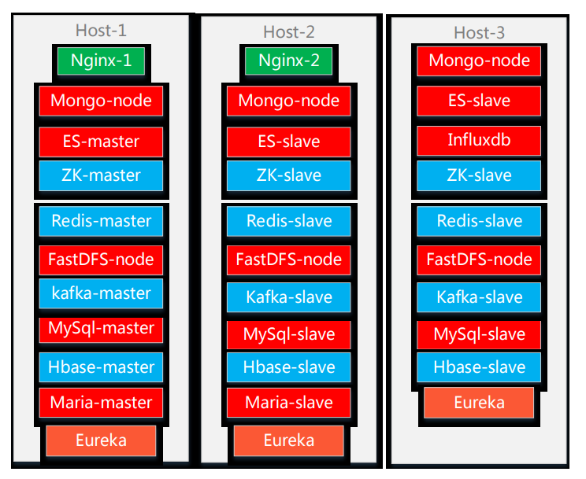
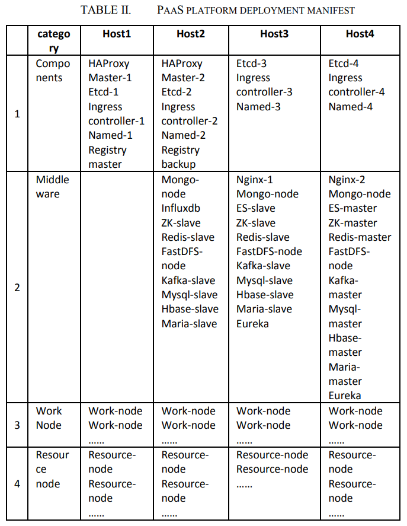

# High Availability Papers

## N+K: High Availability Solution for Stateful Service (2020)

H. Yan and A. Wang, "N+K: High Availability Solution for Stateful Service," 2020 3rd International Conference on Advanced Electronic Materials, Computers and Software Engineering (AEMCSE), Shenzhen, China, 2020, pp. 47-50, doi: 10.1109/AEMCSE50948.2020.00018. [StatefulServices.pdf](StatefulServices.pdf)

Traditional systems follow a notion of `1 active + 1 standby` deployments.  This model is not efficient due to doubling costs and the standby is essentially idle.  Instead, a `N works + K overhead` deployment is fully available and avoids service interruptions of K-outages.

## Design and Implementation of High-availability PaaS Platform (2020)

Z. Wen, Y. Liang and G. Li, "Design and Implementation of High-availability PaaS Platform Based on Virtualization Platform," 2020 IEEE 5th Information Technology and Mechatronics Engineering Conference (ITOEC), Chongqing, China, 2020, pp. 1571-1575, doi: 10.1109/ITOEC49072.2020.9141564. [PaaS.pdf](PaaS.pdf)

The authors describe a kubernetes environment which spans multiple replicas across different hosts.  Each service supports an election process for choosing master nodes.  Placement groups also ensure that hardware failures do not compromise availability.

### What recommendations did they have

1. No more than 25 nodes per host
2. Allocate for 120% resource redundancy
3. One service master per host
4. Worker nodes is odd number >= 3
5. Roughly 2 nodes per computer
6. Number of nodes should be porportional to `resource_nodes x computers/(computers-1)` and under 20
7. Middleware cluster is basically three nodes across three hosts

### What did they test

The environment was deployed into this configuration.  Afterward, they verified arbitrarily rebooting a machine continued meeting the HA-requirements.

## Evaluating High Availability-Aware Deployments (2017)

M. Jammal, A. Kanso, P. Heidari and A. Shami, "Evaluating High Availability-Aware Deployments Using Stochastic Petri Net Model and Cloud Scoring Selection Tool," in IEEE Transactions on Services Computing, vol. 14, no. 1, pp. 141-154, 1 Jan.-Feb. 2021, doi: 10.1109/TSC.2017.2781730 [Evaluating_HA_Deployments.pdf](Evaluating_HA_Deployments.pdf).
