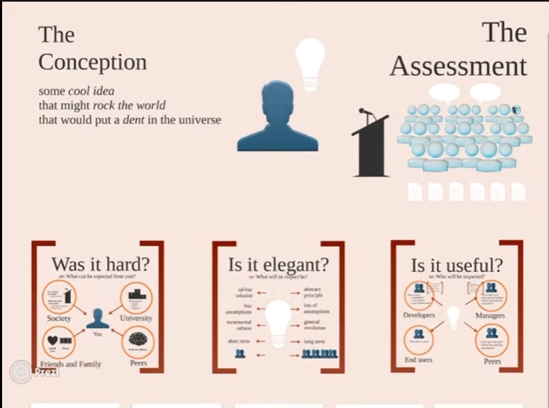
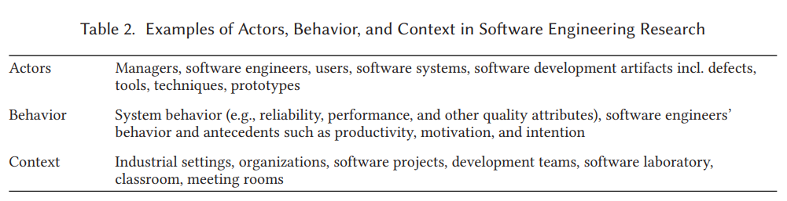

# Readings

## What makes useful research in software engineering (2014)

Zeller, A. (2014). What makes useful research in software engineering. [YouTube](https://youtu.be/4MbixFVWwck).

## The ABC of Software Engineering Research (2018)

Stol, K.-J., & Fitzgerald, B. (2018). The ABC of Software Engineering Research. ACM Transactions on Software Engineering & Methodology, 27(3), 1–51. [EBSCO](https://search-ebscohost-com.proxy1.ncu.edu/login.aspx?direct=true&db=edb&AN=133081194&site=eds-live). [abc_software_research.pdf](abc_software_research.pdf)

> The choice of research strategy is not “good” or “bad” a priori but is very much dependent on the setting and goal of the research. A biologist may be interested in studying the behavior of elephants in groups, for example, in which case a visit to the jungle is warranted, with a considerable lack of
control of variables (and the elephant’s behavior) as an inherent consequence. On the other hand, a researcher may be interested in studying parts of an elephant, such as the structure of its skin, in which the continuous and immediate access that a zoo offers is more appropriate. Besides ease
of access, the zoo environment offers a potentially higher degree of control of measurement of the variables that a researcher might be interested in. However, this comes at the inherent cost of a less realistic context.

## Software Engineering Research Community Viewpoints on Rapid Reviews (2019)

B. Cartaxo et al., "Software Engineering Research Community Viewpoints on Rapid Reviews," 2019 ACM/IEEE International Symposium on Empirical Software Engineering and Measurement (ESEM), Porto de Galinhas, Brazil, 2019, pp. 1-12, doi: 10.1109/ESEM.2019.8870144. [rapid_reviews.pdf](rapid_reviews.pdf).
